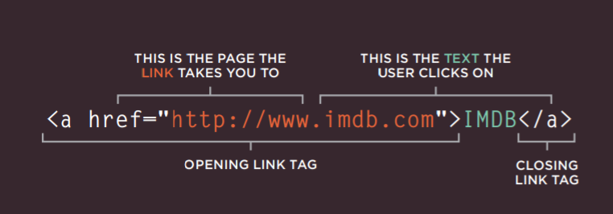

# Read: 04 - HTML Links, CSS Layout, JS Functions

**Links in HTML:**Links are the defining feature of the web
because they allow you to move from
one web page to another — enabling the
very idea of browsing or surfing.

#

**Types of links:**
there aer 5 types of links in HTML5 :

● Links from one website to another

● Links from one page to another on the same website

● Links from one part of a web page to another part of the
same page

● Links that open in a new browser window

● Links that start up your email program and address a new
email to someone

#

**Link Structure in HTML5**:

*Linking to another site:*

#
*Linking to another page in the site:*

    < p>
      < ul>
          < li><a href="index.html">Home</a></ li>
          < li><a href="about-us.html">About</a>< /li>
          < li><a href="movies.html">Movies</a></ li>
          < li><a href="contact.html">Contact</a></ li>
      < /ul>
    </ p>

#
*Email Links:*

    <a href="mailto:124@gmai.com">Email </a>

#

*Opening Links in a New Window:*

    <a href="http://www.imdb.com" target="_blank">
    Internet Movie Database</a> (opens in new window)

#

**Layouts:**

CSS treats each HTML element as if it is in its
own box. This box will either be a block-level
box or an inline box.

### Building Blocks:
- Block-level elements
start on a new line
Examples include:

    < h1 > < p > < ul > < li >

- Inline elements
flow in between
surrounding text
Examples include:

    < img> < b> < i>

#

### CSS has the following positioning schemes :
- Normal flow.
- Relative Positioning.
- Absolute positioning.
- Floating Elements.  
- Fixed Positioning.

#

** Screen Sizes: **
Different visitors to your site will have different sized screens that show
different amounts of information, so your design needs to be able to
work on a range of different sized screens.

the webpage should be Relative and able to adjust based on the screen.

## Functions, Methods, and Objects in JavaScript:

**WHAT IS A FUNCTION?**

Functions let you group a series of statements together to perform a
specific task. If different parts of a script repeat the same task, you can
reuse the function (rather than repeating the same set of statements). 

*Example:*

      var msg = 'Sign up to receive our newsletter for 10% off!';
        function updateMessage() {
        var el = document.getElementByld('message'};
        el .textContent = msg;
        }
        updateMessage(}; 

**Declaring a function:**

