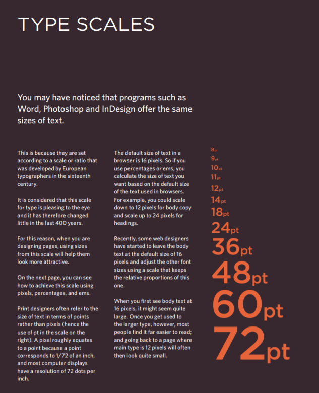

# Read: 05 - HTML Images; CSS Color & Text

## HTML Images:
Images should....
- Be relevant.
- Convey information.
 -Convey the right mood.
- Be instantly recognisable.
- Fit the color palette.

## to add an image to your HTML file:
we use the image tage =>  this tag has a src (source attribute) and that value will hold the name of the image and its extention. alt attribute provides a text descreption.
title
You can also use the title
attribute with the  element
to provide additional information .

also can set a height and a width for the image.

***Example:***

    

### Ways to Place Images in Code:
      
          
There are around 10,000 living species of birds
          that inhabit different ecosystems from the
          Arctic to the Antarctic. Many species undertake
          long distance annual migrations, and many more
          perform shorter irregular journeys.

          

          
There are around 10,000 living
          species of birds that inhabit different
          ecosystems from the Arctic to the Antarctic. Many
          species undertake long distance annual
          migrations, and many more perform shorter
          irregular journeys.

          

          
There are around 10,000 living species of birds
          that inhabit different ecosystems from the
          Arctic to the Antarctic.Many species undertake long
          distance annual migrations, and many more perform
          shorter irregular journeys.

## Colors in HTML:

- Foreground Color

** Ex:**

    /* color name */

          h1 {
          color: DarkCyan;}
          /* hex code */
          h2 {
          color: #ee3e80;}
          /* rgb value */
          p {
          color: rgb(100,100,90);}

- Background Color

** Ex:**

          body {
              background-color: rgb(200,200,200);}
              h1 {
              background-color: DarkCyan;}
              h2 {
              background-color: #ee3e80;}
              p {
              background-color: white;}

#### Every color on a computer screen is created by mixing amounts of red,green, and blue. (RGB System).

also there are other effects in css3 for colors: 
- Opacity
- Contrast

## Text in HTML:
● Structural markup: the elements that you can use to
describe both headings and paragraphs

● Semantic markup: which provides extra information; such
as where emphasis is placed in a sentence, that something
you have written is a quotation (and who said it), the
meaning of acronyms, and so on

**Ex:**

- Headings:

    < h1>This is a Main Heading< /h1>
    < h2>This is a Level 2 Heading< /h2>
    < h3>This is a Level 3 Heading< /h3>
    < h4>This is a Level 4 Heading< /h4>
    < h5>This is a Level 5 Heading< /h5>
    < h6>This is a Level 6 Heading< /h6>

    ***Results:***

    <h1>This is a Main Heading</h1>
    <h2>This is a Level 2 Heading</h2>
    <h3>This is a Level 3 Heading</h3>
    <h4>This is a Level 4 Heading</h4>
    <h5>This is a Level 5 Heading</h5>
    <h6>This is a Level 6 Heading</h6>

- Paragraphs:

**Ex:**

        
A paragraph consists of one or more sentences
          that form a self-contained unit of discourse. The
          start of a paragraph is indicated by a new
          line.

          
Text is easier to understand when it is split up
          into units of text. For example, a book may have
          chapters. Chapters can have subheadings. Under
          each heading there will be one or more
          paragraphs.

- Bold & Italic

**Ex:**

        
This is how we make a word appear <b>bold.</b>
        

        
Inside a product description you might see some
        <b>key features</b> in bold.

- Font Family: 

**Ex:**

font family attribute will be added in css file.

      body {
          font-family: Georgia, Times, serif;}
          h1, h2 {
          font-family: Arial, Verdana, sans-serif;}
          .credits {
          font-family: "Courier New", Courier,
          monospace;}

- Font Size & Font Weight:

font size & font weight attribute will be added in css file.

      body {
          font-family: Arial, Verdana, sans-serif;
          font-size: 12px;
          font-weight: bold;}
          h1 {
          font-size: 200%;
          font-weight: bold;}
          h2 {
          font-size: 1.3em;
          font-weight: bold;}

 ## Type Scales:

