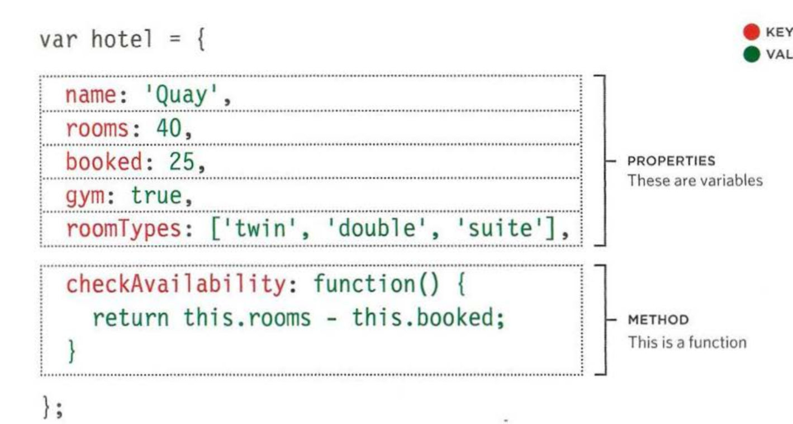

# Read: 06 - JS Object Literals; The DOM:

## Objects in JavaScript:
 **What is an Object?** Objects group together a set of variables and functions to create a model
of a something you would recognize from the real world. In an object,
variables and functions take on new names. 

*Variables*: variables are called properties/attributes for that specific object.

*Functions*: functions are called methods when they're related to a specific object.

###  Example of an Object:

## Accessing an object and dot notaion:
 - You can access the properties or methods of an object using dot notaion .
 - You can also access properties using brackets.

**Ex:**

## DOCUMENT OBJECT MODEL:

The Document Object Model uses
objects to create a representation of
the current page. It creates a new
object for each element (and each
individual section of text)
within the page. 

**The Document Object Model (DOM) specifies
how browsers should create a model of an HTML
page and how JavaScript can access and update the
contents of a web page while it is in the browser window.**

DOM is also known as
**Application Programming Interface (API).**
User interfaces let humans interact with
programs; APls let programs (and scripts)
talk to each other. The DOM states what
your script can "ask the browser about the
current page, and how to tell the browser
to update what is being shown to the user

THE DOM TREE IS A
MODEL OF A WEB PAGE: 

As a browser loads a web page, it creates a model of that page.
The model is called a DOM tree, and it is stored in the browsers' memory.
It consists of four main types of nodes. 