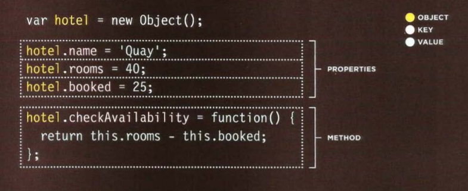
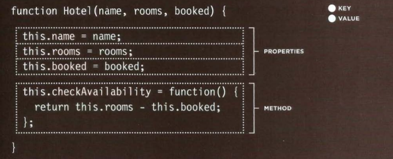

# Read: 07 - HTML Tables; JS Constructor Functions:

## Domain Modeling:

**Domain modeling** is the process of creating a conceptual model in code for a specific problem. A model describes the various entities, their attributes and behaviors, as well as the constraints that govern the problem domain. An entity that stores data in properties and encapsulates behaviors in methods is commonly referred to as an **object-oriented** model.

## Tables in JavaScript:
Tables : A table represents information in a grid format. 

Grids allow us to understand
complex data by referencing
information on two axes. Blocks in the grid is refered to as a **Tabel Cell**.

And in HTML tables are written as row by row.

### Basic Table Structure:
      <table>
            <tr>
              <td>15</td>
              <td>15</td>
              <td>30</td>
            </tr>
            <tr>
              <td>45</td>
              <td>60</td>
              <td>45</td>
            </tr>
            <tr>
              <td>60</td>
              <td>90</td>
              <td>90</td>
            </tr>
            </table>

- < table> tag is the main element.
- < tr> tag (Table Row) is the sub element inside of the table.
- < td> tag (Table Data) holds the value and its the sub element inside the < tr>.
- < th> tag (Table Heading) just like the < td>,it holds a value inside of it.

## More about columns:
** we can do the following:**
- Spanning columns.
- Spanning Rows.

## Long Tables:
long tables contain three different elements added tp the normal table Structure:

- < thead>:The headings of the table should
sit inside the < thead> element. 

- < tbody>: The body should sit inside the
< tbody> element. 

- < tfoot>: The footer belongs inside the
< tfoot> element.

# Functions, Methods, and Objects in JavaScript:

## Creating an object constructor notaion:

## CREATING MANY OBJECTS: CONSTRUCTOR NOTATION

## CREATING OBJECTS USING CONSTRUCTOR SYNTAX:

    var hotel = new Object();
        hotel.name= 'Park';
        hotel.rooms = 120;
        hotel .booked = 77;
        hotel .checkAvailability = function()
        return this.rooms - this.booked;
        } ;
        JAVASCRIPT
        var elName = document.getElementByid('hotelName');
        elName.textContent = hotel . name;
        var elRooms = document .getElementByid('rooms');
        elRooms.textContent = hotel .checkAvailability(}; 