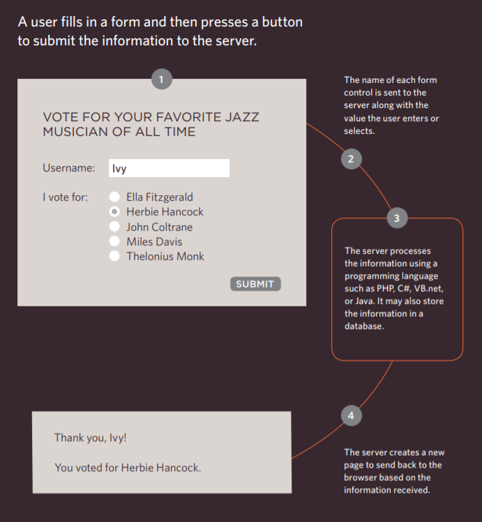

# Read: 09 - Forms and Events

**Forms:**
forms concept in ***HTML*** is used to allow the website users to enter different pieces of information.

**Why do we use Forms:**
it allow users to perform other functions online,
like regestering as a memeber of a website, or entering payment method in a shopping website.

**There are several types of controls in fomrs that you can collect information from, like:**

### Adding Texts:
- Text Input: used for a single line of text.
- Password Input: single line text box but it
masks the characters entered.

- Text Area: used for multi-line texts.

### For maiking choices we use a different type of input:

- Radio Buttons: For use when a user must select
one of a number of options.

- Checkboxes: When a user can select and
unselect one or more options.

- Drop-down boxes: When a user must pick one of a
number of options from a list.

### Submitting Forms:
- Submit Buttons & Image Buttons:
To submit data from your form
to another web page.

### Uploading Files:
- File Upload: Allows users to upload files
(e.g. images) to a website.

## How Forms Work?

## From Structure:
    <form action="http://www.example.com/subscribe.php"
      method="get">
      

        This is where the form controls will appear.
      

        
Username:
            <input type="text" name="username" size="15"
            maxlength="30" />
        

        
Password:
            <input type="password" name="password" size="15"
            maxlength="30" />
        

    </form>

  **Radio Buttons :**
      <form action="http://www.example.com/profile.php">
         
Please select your favorite genre:
         
        <input type="radio" name="genre" value="rock"
        checked="checked" /> Rock
        <input type="radio" name="genre" value="pop" />
        Pop
        <input type="radio" name="genre" value="jazz" />
        Jazz
        

    </form>

**Checkboxes:**
    <form action="http://www.example.com/profile.php">
      

        Please select your favorite music service(s):
         
        <input type="checkbox" name="service"
        value="itunes" checked="checked" /> iTunes
        <input type="checkbox" name="service"
        value="lastfm" /> Last.fm
        <input type="checkbox" name="service"
        value="spotify" /> Spotify
      

    </form>

