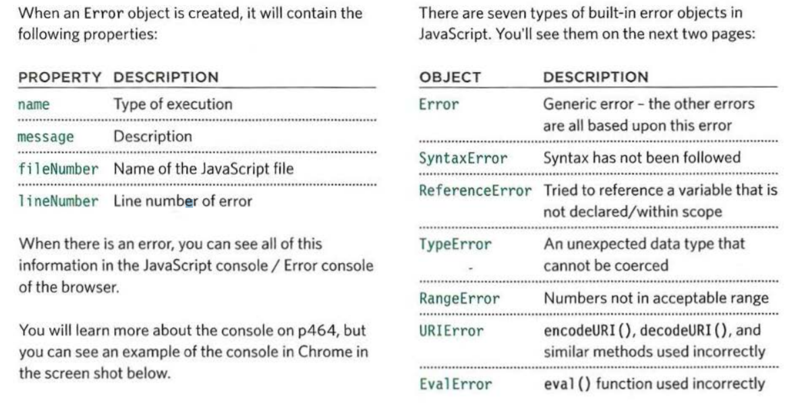
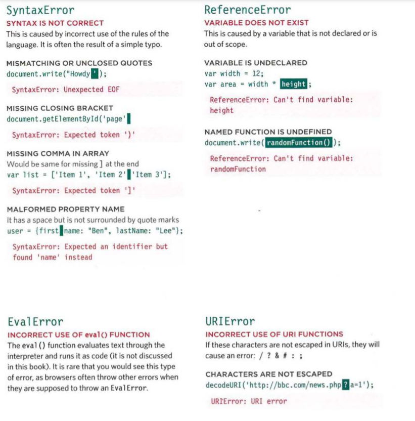
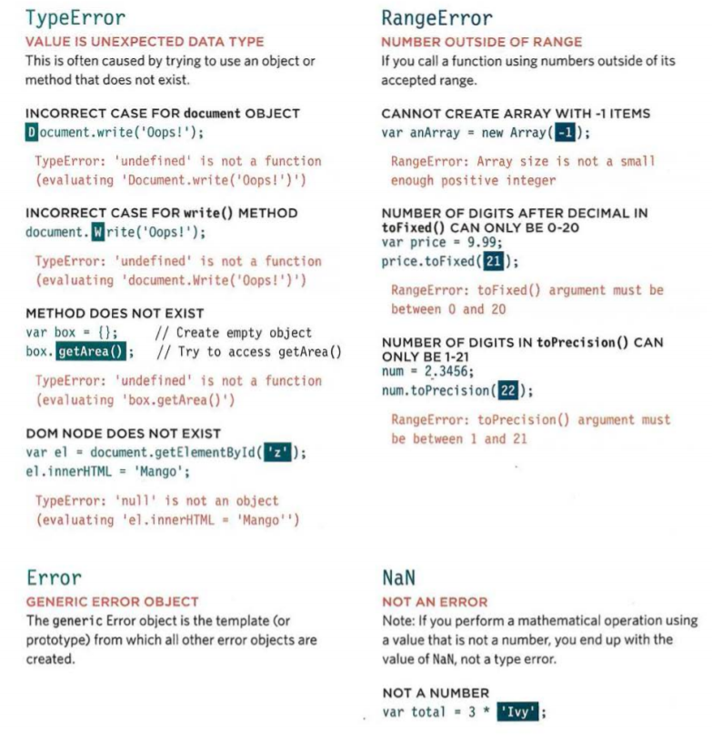

# Read: 10 - JS Debugging

### Error Handling & Debugging:

** * ORDER OF EXECUTION:**
To find the source of an error, it helps to know how scripts are processed.
The order in which statements are executed can be complex; some tasks
cannot complete until another statement or function has been run.

** * EXECUTION CONTEXTS:**
The JavaScript interpreter uses the concept of execution contexts.
There is one global execution context; plus, each function creates a new
new execution context. They correspond to variable scope. 

** Every statement in a script lives in one of three
execution contexts: **

- ** GLOBAL CONTEXT:**
Code that is in the script, but not in a function.
There is only one global context in any page.

- ** FUNCTION CONTEXT:**
Code that is being run within a function.
Each function has its own function context. 

- ** EVAL CONTEXT (NOT SHOWN):**
Text is executed like code in an internal function
called eva l {) (which is not covered in this book). 

-  **GLOBAL SCOPE:**
If a variable is declared outside a function, it can
be used anywhere because it has global scope.
If you do not use the var keyword when creating
a variable, it is placed in global scope. 

## ERROR OBJECTS :

## ERROR OBJECTS CONTI NUED :

# HOW TO DEAL WITH ERRORS :
 **1: DEBUG THE SCRIPT TO FIX ERRORS**

If you come across an error while writing a script
(or when someone reports a bug), you will need to
debug the code, track down the source of the error,
and fix it.
You will find that the developer tools available in
every major modern browser will help you with
this task. In this chapter, you will learn about the
developer tools in Chrome and Firefox. (The tools in
Chrome are identical to those in Opera.)
IE and Safari also have their own tools (but there is
not space to cover them all). 

**2: HANDLE ERRORS GRACEFULLY**

You can handle errors gracefully using try, catch,
throw, and f i na 1 ly statements.
Sometimes, an error may occur in the script for a
reason beyond your control. For example, you might
request data from a third party, and their server
may not respond. In such cases, it is particularly
important to write error-handling code.
In the latter part of the chapter, you will learn how to
gracefully check whether something will work, and
offer an alternative option if it fails.