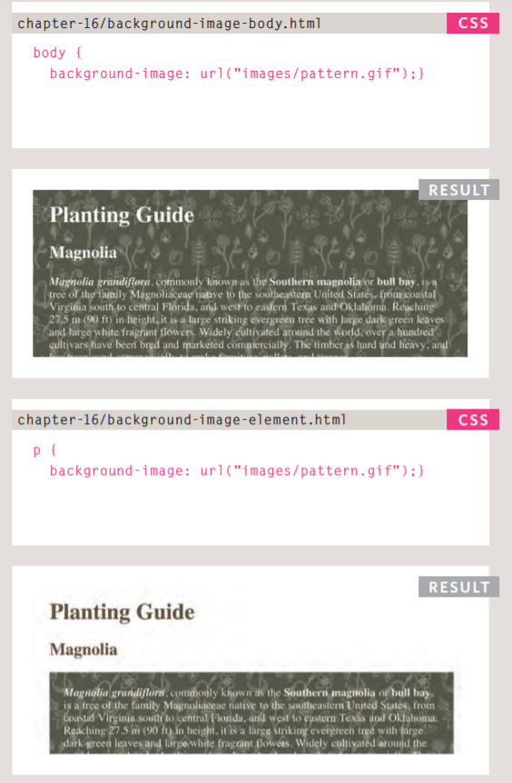

# Read: 11 - Assorted Topics

## Images in HTML/CSS:
    
- src attribute: hold the value of the image's path.

- alt attribute: hold a description of the image.

#### - Controlling size of images in **CSS**:
**Ex:**

**-HTML**:

    
    
    

**-CSS**: large , medium & small sizes.

      img.large {
      width: 500px;
      height: 500px;}

      img.medium {
      width: 250px;
      height: 250px;}

      img.small {
      width: 100px;
      height: 100px;}

#### - Aligning images using  **CSS**:
**-HTML**:

      

      <b><i>Magnolia</i></b> is a large genus that
        contains over 200 flowering plant species...

      

        Some magnolias, such as <i>Magnolia stellata</i>
        and <i>Magnolia soulangeana</i>, flower quite
        early in the spring before the leaves open...

**-CSS**: large , medium & small aligning.

      img.align-left {
        float: left;
        margin-right: 10px;}

        img.align-right {
        float: right;
        margin-left: 10px;}

        img.medium {
        width: 250px;
        height: 250px;}

#### - Centering images using  **CSS**:
**-HTML**:

      

      <b><i>Magnolia</i></b> is a large genus that
      contains over 200 flowering plant species. It
      is named after French botanist Pierre Magnol and,
      having evolved before bees appeared, the
      flowers were developed to encourage pollination
      by beetle.

**-CSS**: large , medium & small aligning.

      img.align-center {
      display: block;
      margin: 0px auto;}

      img.medium {
      width: 250px;
      height: 250px;}

#### - Adding a background image:

## Practical Information:

### SEO:
**Search Engine Optimization: **
***SEO*** is a huge topic and several books have been written on the subject.
The following pages will help you understand the key concepts so you can
improve your website's visibility on search engines

- **The Basic** :
Search engine optimization (or
SEO) is the practice of trying
to help your site appear nearer
the top of search engine results
when people look for the topics
that your website covers.
At the heart of SEO is the idea of
working out which terms people
are likely to enter into a search
engine to find your site and then
using these terms in the right
places on your site to increase
the chances that search engines
will show a link to your site in
their results.

- **On-Page Techniques** :
On-page techniques are the
methods you can use on your
web pages to improve their
rating in search engines.
The main component of this is
looking at keywords that people
are likely to enter into a search
engine if they wanted to find
your site, and then including
these in the text and HTML code
for your site in order to help the
search engines know that your
site covers these topics.

- **Off-Page Techniques** :
Getting other sites to link to you
is just as important as on-page
techniques. Search engines help
determine how to rank your
site by looking at the number of
other sites that link to yours.
They are particularly interested
in sites whose content is related
to yours. For example, if you
were running a website that
sold fish bait, then a link from
a hairdresser is not likely to be
considered as relevant as one 

### On-Page SEO keys:
1: Page Title.

2: URL / Web Address.

3: Headings.

4: Text.

5: Link Text.

6: Image Alt Text.

7: Page Descriptions.

