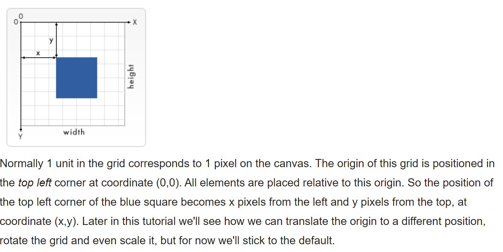

# Read: 12 - Docs for the HTML <canvas> Element & Chart.js

###  Chart.js API.
**Chart.js API:** is a JavaScript plugin that uses HTML5’s canvas element to draw the graph onto the page. It’s a well documented plugin that makes using all kinds of bar charts, line charts, pie charts and more, incredibly easy.

### Setting up:
The first thing we need to do is download Chart.js. Copy the Chart.min.js out of the unzipped folder and into the directory you’ll be working in. Then create a new html page and import the script:

      <!DOCTYPE html>
      <html lang="en">
          <head>
              <meta charset="utf-8" />
              <title>Chart.js demo</title>
              
          </head>
          <body>
          </body>
      </html>

### There are many types of Charts:
- Drawing a line chart: 

code ex:

    <canvas id="buyers" width="600" height="400"></canvas>

    

- Drawing a pie chart: 

code ex:

    <canvas id="countries" width="600" height="400"></canvas>

    var countries= document.getElementById("countries").getContext("2d");
    new Chart(countries).Pie(pieData, pieOptions);

- Drawing a bar chart.

## Basic usage of canvas:

- **The <canvas> element:**
At first sight a **<canvas>** looks like the ****element, with the only clear difference being that it doesn't have the src and alt attributes. Indeed, the **<canvas>** element has only **two attributes, width & height**. These are both optional and can also be set using DOM properties. When no width and height attributes are specified, the canvas will initially be 300 pixels wide and 150 pixels high. The element can be sized arbitrarily by CSS, but during rendering the image is scaled to fit its layout size: if the CSS sizing doesn't respect the ratio of the initial canvas, it will appear distorted.

- **The rendering context:**
The **<canvas>** element creates a fixed-size drawing surface that exposes one or more **rendering contexts**, which are used to create and manipulate the content shown. In this tutorial, we focus on the 2D rendering context. Other contexts may provide different types of rendering; for example, **WebGL** uses a 3D context based on **OpenGL ES.**

- **A skeleton template:**

      <!DOCTYPE html>
      <html>
        <head>
          <meta charset="utf-8"/>
          <title>Canvas tutorial</title>
          
          
        </head>
        <body onload="draw();">
          <canvas id="tutorial" width="150" height="150"></canvas>
        </body>
      </html>

## Drawing shapes with canvas:

- **The Grid:**
The canvas grid or coordinate space.

HTML skeleton from the previous page had a canvas element 150 pixels wide and 150 pixels high.

## Applying styles and colors:
 ** * Colors:**
- fillStyle = color
Sets the style used when filling shapes.

- strokeStyle = color
Sets the style for shapes' outlines.

## Drawing text:
- fillText(text, x, y [, maxWidth]) :

Fills a given text at the given (x,y) position. Optionally with a maximum width to draw.

- strokeText(text, x, y [, maxWidth]):

Strokes a given text at the given (x,y) position. Optionally with a maximum width to draw.